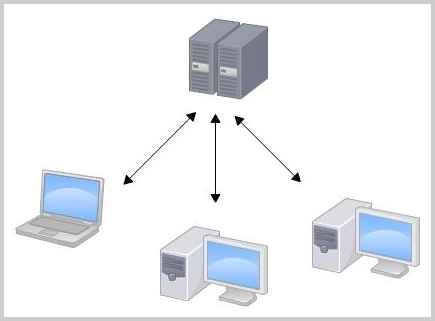
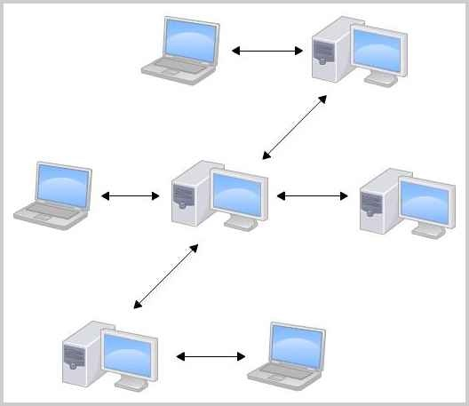

# Git 学习
> 教程来源：廖雪峰的 Git 教程 https://www.liaoxuefeng.com/wiki/
> 分享人：zengqingqing
> 日期：2026-02-25

## 核心问题
- Git 是什么？
- 为什么要使用 Pencil 还原设计稿？
- 为什么要将设计工作流搬到 Git ?
- 现阶段重点是做什么？

## Git 是什么？
Git 是目前世界上最先进的分布式版本控制系统
集中式 VS 分布式





## 为什么要使用 pencil 还原设计稿？
> 版本控制系统的适用范围：TXT 文件、HTML / CSS、程序代码等。
> 二进制文件的限制：图片、视频等属于二进制文件。虽然也可以被 Git 管理，但无法追踪具体内容变化。系统只能记录文件整体发生变化，例如：文件大小从 100KB，变成 120KB，无法知道具体修改了哪一部分内容。

本质区别：
- 图片式设计 = 视觉产物，无法被精确 Diff。
- 结构化（例如组件化、Token 化、JSON 化）设计 = 可追踪的系统规格


## 为什么要将设计工作流搬到 Git ?
把设计搬到 Git，不是为了「方便管理文件」。而是为了让设计进入工程体系，成为可版本化、可审查、可验证的系统规格。

#### 一、版本管理：让设计变成「可追溯资产」
**1.1 设计不再是 V1.0 / V1.1 的文件堆积，Git 能自动记录每一次改动：**
- 不需要复制多个文件版本
- 不需要人工标注「最终版-终极-真的最终」
- 所有改动都天然可回溯

**1.2 可以精确查看某次改动（Diff：Difference），开发可以看到：**
- 哪个组件/字段/尺寸/交互改了
- 这对工程极其友好

**1.3 在 Figma 里：**
- 我们通常把所有内容堆在一个大文件里
- 文件加载慢，微小改动难以追踪
- 没有规范化 PR 流程，改动原因缺少说明
- 组件引用混乱

> 最终导致：
> 设计变更是「感知型」的，而不是「结构型」的。

**1.4 Git + PR 可以强制形成：**
- 改动说明
- 审核流程
- 变更记录
- 责任清晰
- 设计开始具备「工程属性」


#### 二、安全左移
- 安全左移（Shift Left Security）：把安全工作从开发后期，前移到开发早期甚至设计阶段。
> 「左移」这个说法来自软件生命周期流程图：
> 需求 → 设计 → 开发 → 测试 → 上线 → 运维
> ↑ 左边是更早阶段

- 设计变成「系统规格」的一部分，设计走查变成像单元测试一样「必须通过」的环节了，这本质是一种：设计左移（Design Shift Left），这种左移给系统带来了「端到端」试错的能力。

## 现阶段的重点工作
1. 跑通工作流，最小的试错成本
2. 达成共识：不改变团队成员的职能（前端拿到 Pencil 文件还是跟拿到 Figma 文件一样开始工作）只是改变协作方式（Gi+PR）
3. 约定哪些文档是前端可用的（README）

## 学习使用
#### 1. 安装 Git
```
 brew install git
```
并配置 Git 的用户名和邮箱

#### 2. 创建版本库
##### 2.1 在空目录下创建 Git 仓库
版本库（Repository，简称 Repo）可以理解为一个被 Git 管理的目录。
在这个目录中：
- 所有文件的新增、修改、删除都会被记录
- 每一次变更都可以追溯
- 可以在未来任意时间「回滚」到某个历史版本

在我的Mac上，这个仓库位于 /Users/zengqingqing/workspace/builder

-------

```.git``` 是什么？
当你创建版本库后，目录中会生成一个隐藏文件夹```.git```，它是 Git 用来记录版本信息的核心目录。

⚠️ 不要手动修改 ```.git``` 里的内容，否则可能会破坏仓库
如果想查看隐藏文件，可以使用：用```ls -ah```命令就可以看见。


##### 2.2 把文件添加到版本库
编写一个 ```readme.txt``` 文件，内容如下
```
Git is a version control system.
Git is free software.
```
放到 ```builder``` 目录下

第一步，用命令```git add```告诉 Git，把文件添加到仓库：
```
git add readme.txt
```

第二步，用命令 ```git commit```告诉 Git，把文件提交到仓库：
```
git commit -m "wrote a readme file"
[master (root-commit) eaadf4e] wrote a readme file
 1 file changed, 2 insertions(+)
 create mode 100644 readme.txt
```

解释```git commit```命令，```-m``` 后面输入的是本次提交的说明，方便从历史记录里方便地找到改动记录。

```git commit``` 命令执行成功后会告诉你，```1 file changed```：1个文件被改动（我们新添加的 readme.txt 文件）；```2 insertions```：插入了两行内容（readme.txt 有两行内容）。

#### 3. 时光机穿梭
##### 3.1 版本回退

##### 小结
- 要随时掌握工作区的状态，使用```git status```命令
- 如果```git status```告诉你有文件被修改过，用```git diff```可以查看修改内容
- ```git status``` → ```git add``` → ```git commit -m"xxxxx"``` → ```git status```
- 当你不断修改文件，并提交到版本库时，Git 会为当前状态保存一个「快照」，这个快照叫做 commit。每一次 commit，都是一次可回溯的版本记录。

-------

##### 版本回退步骤

修改  ```readme.txt ``` 文件，改成如下内容:
```
Git is a distributed version control system.
Git is free software.
```

现在，运行```git status```命令看看结果：
```
git status
On branch master
Changes not staged for commit:
  (use "git add <file>..." to update what will be committed)
  (use "git checkout -- <file>..." to discard changes in working directory)
	modified:   readme.txt
no changes added to commit (use "git add" and/or "git commit -a")
```

运行 ```git diff```这个命令看看 different：
```
git diff readme.txt 
diff --git a/readme.txt b/readme.txt
index 46d49bf..9247db6 100644
--- a/readme.txt
+++ b/readme.txt
@@ -1,2 +1,2 @@
-Git is a version control system.
+Git is a distributed version control system.
 Git is free software.

```

提交修改和提交新文件是一样的两步，第一步是 ```git add```
```
git add readme.txt
```

第二步```git commit```之前，我们再运行```git status```看看当前仓库的状态：
```
git status
On branch master
Changes to be committed:
  (use "git reset HEAD <file>..." to unstage)

	modified:   readme.txt
```
```git status```告诉我们，将要被提交的修改包括 ```readme.txt```，下一步，就可以放心地提交了：
```
git commit -m "add distributed"
[master e475afc] add distributed
 1 file changed, 1 insertion(+), 1 deletion(-)
```
提交后，我们再用```git status```命令看看仓库的当前状态：
```
 git status
On branch master
nothing to commit, working tree clean
```

```git log```命令显示从最近到最远的提交日志，我们可以看到3次提交，最近的一次是 append GPL，上一次是 add distributed，最早的一次是 wrote a readme 

> 未完待续...


